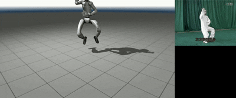

# 2D 视频 → 3D 人体姿态 → Unitree G1 人形机器人运动映射

将一段普通视频中的人体动作，通过 **MediaPipe 2D 姿态检测 → VideoPose3D 3D 姿态估计 → 逆运动学 (IK) 映射** 的完整流程，驱动 Unitree G1 人形机器人做出相同动作。

## 效果展示



*左：G1 机器人 MuJoCo 仿真  | 右：原始视频*

## 项目结构

```
.
├── run_inference_modular.py      # 模块化推理：MediaPipe 2D + VideoPose3D 3D
├── h36m_to_g1.py                 # H3.6M 3D 骨架 → G1 关节角映射（IK 求解）
├── play_g1_motion.py             # 在 MuJoCo 查看器中播放 G1 关节角动画
├── merge_videos.py               # 左右并排合成两个视频（用于制作对比 GIF）
├── taiji.mp4                     # 示例输入视频（太极拳）
├── assets/
│   └── compare.gif               # 效果展示 GIF
├── model/
│   ├── pose_landmarker_heavy.task    # MediaPipe 姿态检测模型
│   └── videopose3d_finetuned_v3.onnx # VideoPose3D ONNX 模型（微调 V3）
└── unitree_g1/                   # Unitree G1 机器人模型文件（URDF/MJCF）
    ├── g1_mocap_29dof.xml        # MuJoCo 模型（29 自由度，含手部）
    ├── g1_custom_collision_29dof.urdf
    └── meshes/                   # 网格文件
```

## 安装

### 依赖

```bash
pip install mediapipe onnxruntime numpy opencv-python matplotlib scipy mujoco mink
```

> **注意**：`mink` 是 IK 求解库，需要 Python 3.10+。如果安装失败，可参考 [mink 官方文档](https://github.com/kevinzakka/mink)。

### 模型文件

项目已包含以下模型文件：
- `model/pose_landmarker_heavy.task` — MediaPipe 姿态检测模型
- `model/videopose3d_finetuned_v3.onnx` — VideoPose3D 微调 ONNX 模型

## 使用方法

### 完整流程（三步）

#### 步骤 1：2D → 3D 姿态推理

从输入视频中提取 2D 关键点（MediaPipe），再通过 VideoPose3D 预测 3D 骨架：

```bash
python run_inference_modular.py
```

- 输入：`taiji.mp4`（可在脚本中修改 `VIDEO_PATH`）
- 输出：`taiji.npz`（3D 姿态数据）+ `taiji_result.mp4`（2D+3D 可视化视频）
- 可视化包含 4 个视角：2D 骨架 / 3D 侧面 / 3D 正面 / 3D 俯视

#### 步骤 2：H3.6M 3D 骨架 → G1 关节角映射

将 VideoPose3D 输出的 H3.6M 格式 3D 骨架，通过逆运动学 (IK) 映射到 G1 机器人的 29 个关节角：

```bash
python h36m_to_g1.py
```

- 输入：`taiji.npz`（上一步的输出）
- 输出：`g1_joint_angles.npz`（关节角数据）+ `g1_mapping_result.mp4`（H3.6M ↔ G1 对比可视化）
- 日志：`mapping_debug.log`

#### 步骤 3：在 MuJoCo 中播放 G1 动作

在 MuJoCo 交互式查看器中播放 G1 机器人动画：

```bash
python play_g1_motion.py
```

保存为视频：

```bash
python play_g1_motion.py --save
python play_g1_motion.py --save -o my_video.mp4   # 指定输出路径
```

### 辅助工具

#### 合成对比视频

将两个视频左右并排合成（例如原始视频和 G1 仿真视频）：

```bash
python merge_videos.py taiji_result.mp4 g1_mapping_result.mp4 -o merged.mp4 --height 720
```

## 实现步骤详解

### 1. 2D 关键点检测 (`run_inference_modular.py`)

- 使用 **MediaPipe Pose Landmarker**（`pose_landmarker_heavy.task`）逐帧检测 33 个人体关键点
- 将 MediaPipe 的 33 个关键点映射到 **H3.6M 17 关节格式**（Human3.6M 标准骨架）
- 后处理：
  - **缺失帧插值**：对漏检帧进行线性插值填补
  - **异常值剔除**：滑动中值检测，偏差 > 40px 的点替换为中值
  - **Savitzky-Golay 平滑**：窗口 21，3 阶多项式，消除抖动

### 2. 3D 姿态估计 (`run_inference_modular.py`)

- 使用 **VideoPose3D**（`videopose3d_finetuned_v3.onnx`）从 2D 关键点预测 3D 坐标
- 模型感受野：243 帧（约 8 秒上下文）
- 输入归一化：像素坐标 → 屏幕坐标（`[-1, 1]` 范围）
- 输出：(T, 17, 3) 的 3D 骨架坐标（H3.6M 坐标系，Y- 向上）

### 3. 坐标系对齐 (`h36m_to_g1.py`)

VideoPose3D 的 H3.6M 坐标系与 MuJoCo 坐标系不同，需要转换：

| 方向 | H3.6M | MuJoCo |
|------|-------|--------|
| 上 | Y- | Z+ |
| 前 | Z+ | X+ |
| 右 | X+ | Y- |

变换矩阵：
```
R_Y_TO_Z = [[1, 0, 0], [0, 0, 1], [0, -1, 0]]
```

此外，还需根据人体朝向（肩向量 × 躯干上方向）将正面旋转到 MuJoCo 的 X+ 方向。

### 4. 骨盆轨迹估计 (`h36m_to_g1.py`)

VideoPose3D 输出的 3D 坐标以骨盆为原点（骨盆始终在 (0,0,0)），但机器人需要世界空间中的移动轨迹。

**算法**：通过检测支撑脚（速度低 + 位置低的脚），将支撑脚在骨架坐标系中的位移取反，累积得到骨盆在世界空间中的移动轨迹。

### 5. 逆运动学求解 (`h36m_to_g1.py`)

使用 **mink** 库求解微分 IK：

- **目标构建**：用 G1 的骨骼长度 + H3.6M 的方向向量，通过正运动学计算各末端（脚踝、手腕、头部）的目标位置
- **IK 求解**：为每个末端创建 `FrameTask`，迭代求解关节角度
- **防突变**：通过 `PostureTask` 约束相邻帧的关节角差异，避免帧间跳变
- **关节限位**：使用 `ConfigurationLimit` 确保关节角在安全范围内

### 6. 输出平滑 (`h36m_to_g1.py`)

对输出的 29 维关节角做 Savitzky-Golay 滤波（窗口 7，3 阶），消除 IK 求解中的微小抖动。

### 7. MuJoCo 播放 (`play_g1_motion.py`)

- 支持 **root motion**：骨盆位置 + 身体朝向（yaw 角），实现机器人在场景中的移动
- 交互式查看器：实时循环播放
- 离线渲染：保存为 MP4 视频

## 技术栈

| 组件 | 技术 |
|------|------|
| 2D 姿态检测 | [MediaPipe Pose](https://developers.google.com/mediapipe/solutions/vision/pose_landmarker) |
| 3D 姿态估计 | [VideoPose3D](https://github.com/facebookresearch/VideoPose3D) (ONNX) |
| 逆运动学 | [mink](https://github.com/kevinzakka/mink) |
| 物理仿真 | [MuJoCo](https://mujoco.org/) |
| 机器人模型 | [Unitree G1](https://www.unitree.com/g1/) |
| 数据处理 | NumPy, SciPy, OpenCV |

## 参考

- [VideoPose3D: 3D Human Pose Estimation from 2D Keypoints](https://github.com/facebookresearch/VideoPose3D)
- [Unitree G1 Robot](https://www.unitree.com/g1/)
- [mink: Differentiable Inverse Kinematics](https://github.com/kevinzakka/mink)
